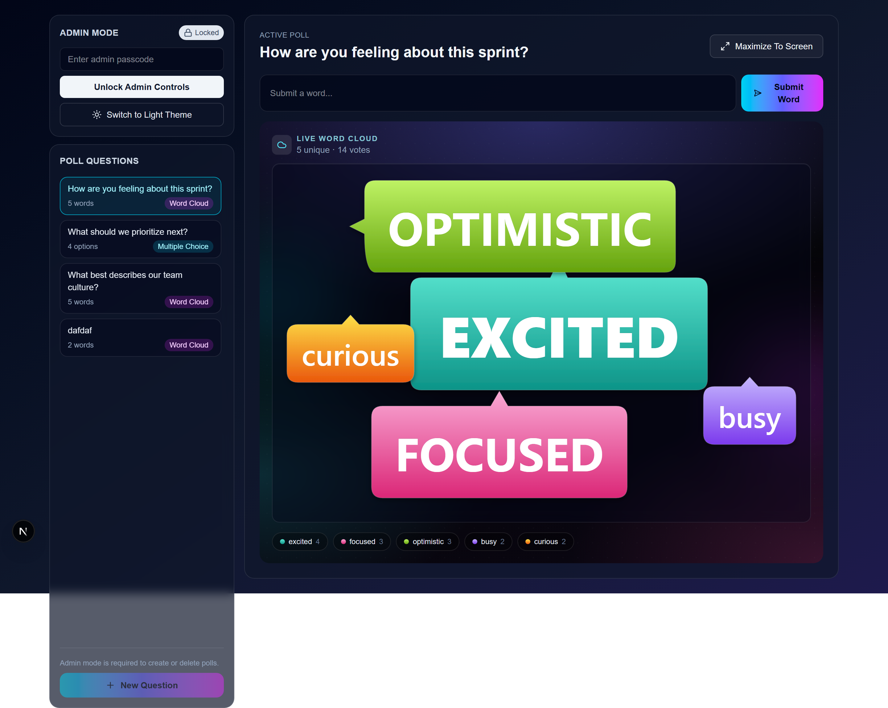
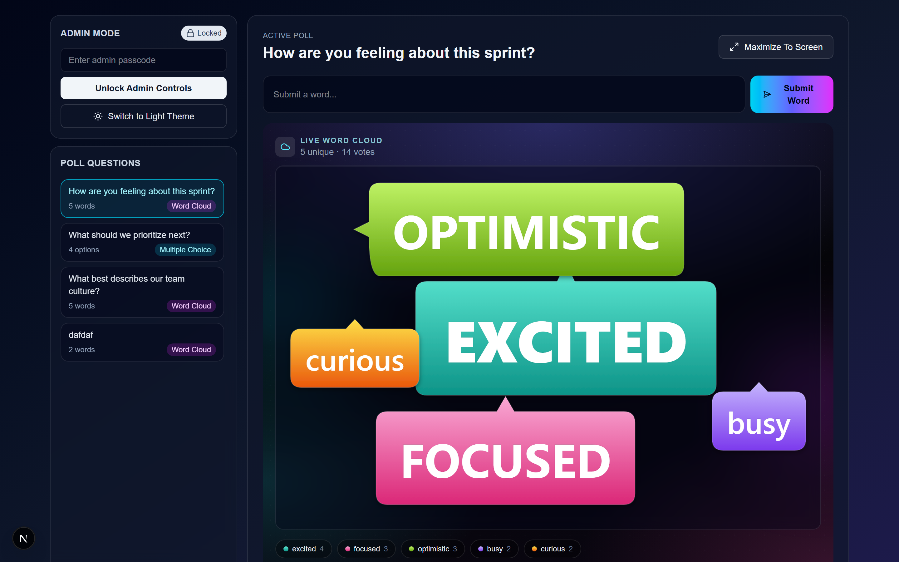
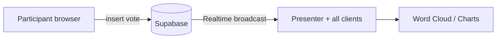

# Word Cloud Polls

A **Microsoft Teams–style live polling app** built with Next.js. Run Word Cloud and Multiple Choice polls in meetings, classrooms, or workshops — with **real-time updates** across every device.



<p align="center">
  
</p>


---

## Features

### Poll types

| Type | Audience experience | Host view |
|------|---------------------|-----------|
| **Word Cloud** | Submit a single word; repeated words grow larger | Colorful animated cloud + word list with vote counts |
| **Multiple Choice** | Tap one option | Live percentage bars (Teams-style results) |

### Live collaboration

- **Supabase Realtime** — votes appear on all screens without refresh
- **One vote per browser session** per poll (enforced in database + UI)
- **Fullscreen presentation mode** for projectors and Teams shares

### Admin controls

- Passcode-protected **Admin Mode**
- Create polls (Word Cloud or Multiple Choice, 2–4 options)
- Delete polls and individual word submissions
- Sample polls seeded via database scripts

### UX & design

- **Dark / light theme** toggle (persisted locally)
- Responsive layout with sidebar navigation
- **Creative word cloud stage** — aurora gradient backdrop, dot texture, glass frame, golden-angle “bloom” layout
- **Gradient words** — each term gets its own color pair + soft glow (dark); refined solids on light theme
- **All words always visible** — organic layout with collision resolve + auto-fit to any screen size
- **Live legend** — colored chips sync hover with the cloud; empty state when waiting for first vote
- Animated entrance (scale-in on dark, fade on light) and hover emphasis
- Vote counts shown as `word (3)` — real submissions, not internal weights

---

## Tech stack

| Layer | Technology |
|-------|------------|
| Framework | [Next.js 16](https://nextjs.org) (App Router) |
| Language | TypeScript |
| Styling | Tailwind CSS v4 |
| Database | [Supabase](https://supabase.com) (Postgres + Realtime) |
| Visualization | d3-cloud, d3-selection, d3-ease |
| Icons | lucide-react |
| Hosting | [Vercel](https://vercel.com) (free tier) |

---

## Quick start

### 1. Clone and install

```bash
git clone <your-repo-url>
cd word-cloud
npm install
```

### 2. Configure Supabase

1. Create a free project at [supabase.com](https://supabase.com).
2. Run the SQL scripts in [docs/DATABASE.md](./docs/DATABASE.md) (schema → fix-rls if needed → seed).
3. Copy `.env.example` to `.env.local` and fill in your keys:

```bash
cp .env.example .env.local
```

```env
NEXT_PUBLIC_SUPABASE_URL=https://your-project.supabase.co
NEXT_PUBLIC_SUPABASE_ANON_KEY=your-publishable-or-anon-key
SUPABASE_SERVICE_ROLE_KEY=your-service-role-key
ADMIN_PASSWORD=your-secure-passcode
```

### 3. Run locally

```bash
npm run dev
```

Open [http://localhost:3000](http://localhost:3000).

---

## Project structure

```
word-cloud/
├── app/
│   ├── page.tsx              # Main poll dashboard (client)
│   ├── actions/polls.ts      # Server actions (admin CRUD)
│   └── layout.tsx
├── components/
│   ├── WordCloudPanel.tsx    # Stage UI (backdrop, legend, empty state)
│   ├── WordCloud.tsx         # SVG bloom renderer + gradients
│   └── PollSidebar.tsx       # Question list + create flow
├── hooks/
│   └── usePollData.ts        # Fetch + Realtime sync
├── lib/
│   ├── aggregate.ts          # Build cloud/chart data from responses
│   ├── submit-vote.ts        # Client-side vote inserts
│   ├── session.ts            # Browser session ID
│   └── supabase/             # Supabase clients
├── docs/
│   ├── images/
│   │   ├── app-screenshot.png      # Full-page README screenshot
│   │   ├── portfolio-showcase.png  # 1440×900 — portfolio / project card
│   │   └── portfolio-square.png    # Square crop — profile / thumbnail icon
│   ├── DATABASE.md           # SQL scripts (not in git under /supabase)
│   └── DEPLOYMENT.md         # Vercel deploy guide
├── scripts/
│   └── capture-screenshots.mjs # Regenerate images (requires dev server)
└── .env.example              # Template only — safe to commit
```

---

## Documentation

| Guide | Description |
|-------|-------------|
| [docs/DATABASE.md](./docs/DATABASE.md) | Schema, RLS fixes, sample word seeds |
| [docs/DEPLOYMENT.md](./docs/DEPLOYMENT.md) | Vercel env vars and production checklist |

---

## How voting works



1. Each browser gets a unique `session_id` in `sessionStorage`.
2. A vote inserts one row into `poll_responses`.
3. The unique constraint `(poll_id, session_id)` blocks double voting.
4. All clients subscribe to `postgres_changes` and re-aggregate results.

---

## Scripts

| Command | Description |
|---------|-------------|
| `npm run dev` | Start development server |
| `npm run build` | Production build |
| `npm run start` | Run production server locally |
| `npm run lint` | ESLint |
| `npm run screenshots` | Capture README + portfolio images (`npm run dev` first) |

### Screenshots & portfolio assets

| File | Use |
|------|-----|
| [docs/images/app-screenshot.png](./docs/images/app-screenshot.png) | Full-page shot for README |
| [docs/images/portfolio-showcase.png](./docs/images/portfolio-showcase.png) | Wide hero / project gallery (1440×900) |
| [docs/images/portfolio-square.png](./docs/images/portfolio-square.png) | Square crop for profile or card thumbnails |

Regenerate after UI changes:

```bash
npm run dev
# in another terminal:
npm run screenshots
```

---

## Security notes

- **Do not commit** `.env.local`, service role keys, or local `/supabase/` SQL copies.
- Admin actions are gated by `ADMIN_PASSWORD` on the server.
- For production, prefer `SUPABASE_SERVICE_ROLE_KEY` for admin mutations and keep RLS strict on public tables.

---

## License

MIT — use freely for demos, internal tools, and workshops.
